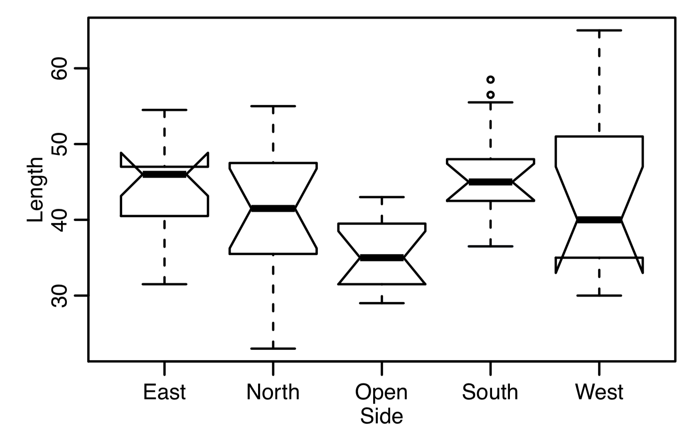

```{r setup, include=FALSE}
knitr::opts_chunk$set(echo = TRUE)
library(ggplot2)
library(gtable)
library(grid)
library(gridExtra)
```

Instead of presentations we will present our solutions here. This is a first preliminary version of this homepage and I used the Solutions students handeded in. 

# Exercise 2 (by Stephan Peischl)

In this exercise, we consider four data sets constructed by the British statistician Frank Anscombe. Each data set consists of a response variable Y and an explanatory variable X.
The data sets can be made available in R using the command

```{r}
data(anscombe)
```
After this, a data frame anscombe is available with the four variable pairs (x1, y1), (x2, y2), (x3, y3), and (x4, y4).

## Solution

a) We first plot the four data sets as scatterplots and add a linear regression line. I use ggplot2 here:

```{r }
data(anscombe)
p1 = ggplot(data = anscombe,aes(x=x1,y=y1)) + 
  geom_point() +
  geom_smooth(method = lm) +
  theme_classic()

p2 = ggplot(data = anscombe,aes(x=x2,y=y2)) + 
  geom_point() +
  geom_smooth(method = lm) +
  theme_classic()

p3 = ggplot(data = anscombe,aes(x=x3,y=y3)) + 
  geom_point() +
  geom_smooth(method = lm) +
  theme_classic()

p4 = ggplot(data = anscombe,aes(x=x4,y=y4)) + 
  geom_point() +
  geom_smooth(method = lm) +
  theme_classic()


grid.arrange(p1,p2,p3,p4,nrow = 2)
```

In base R the plots can be done like this:

```{r}
model1 = lm(y1~x1,data=anscombe)
model2 = lm(y2~x2,data=anscombe)
model3 = lm(y3~x3,data=anscombe)
model4 = lm(y4~x4,data=anscombe)

par(mfrow=c(2,2))

plot(anscombe$x1,anscombe$y1,xlab="x1",ylab="y1")
abline(model1)

plot(anscombe$x2,anscombe$y2,xlab="x2",ylab="y2")
abline(model2)

plot(anscombe$x3,anscombe$y3,xlab="x3",ylab="y3")
abline(model3)

plot(anscombe$x4,anscombe$y4,xlab="x4",ylab="y4")
abline(model4)
```

These models look pretty similar but the underlying data looks very different. You can see that only in the first case a linear regression is reasonable. In the second case the relationship between X and Y is not linear but quadratic. In the third case an outlier has a huge influence on the estimated parameters. In the forth case the regression line is only dependent on one point.

b) We next explore the fitted models in more detail. To do so, we can look at the summary of each model:

```{r }
summary(model1)
summary(model2)
```

To make the comparsion easier, I extract the fitted parameters and store them in a data frame. I then use the knitr function kable to display it in a nice table format.

```{r }
model.params = data.frame(
  Model1 = c(model1$coefficients,summary(model1)$sigma,summary(model1)$r.squared),
  Model2 = c(model2$coefficients,summary(model2)$sigma,summary(model2)$r.squared),
  Model3 = c( model3$coefficients,summary(model3)$sigma,summary(model3)$r.squared),
  Model4 =c(model4$coefficients,summary(model4)$sigma,summary(model4)$r.squared))

rownames(model.params)= c("intercept","slope","sigma","R2")

knitr::kable(model.params)
```

For all four models, the estimated parameters as well as $R^2$ are almost identical. It is absolutely necessary to always make a visual check of the data and the fitted model. If the linearity assumption does not hold, quality measures such as $R^2$ have little meaning. 


# Exercise 3 (by Chiara Durrer)

For Ex 3a the data is read in and a simple linear model built

```{r farm}
farm = read.table("farm.dat", header = TRUE)
farm.fit <- lm(Dollar ~ cows, data = farm)
summary(farm.fit)
```

For Ex 3b the Confidence interval for 0, 20 and exactly 8.85 cows is looked at:
The first attempt gives it for every cow composition

```{r Ex 3b}
predict(farm.fit, interval = "confidence")
predict(farm.fit, newdataframe = data.frame(cows=c(0,20,8.85), interval = "confidence"))
```
For Ex 3c first a simple regression model Dollar ~ Acres is done and then a multiple regression model with Dollars against I&A
```{r Ex3c}
farm.fit2 <- lm(Dollar ~ acres, data = farm)
summary(farm.fit2)

farm.fit3 <- lm(Dollar ~ acres + cows, data = farm)
summary(farm.fit3)
```

Comparing the three models it get clear that the cows are highly influencing the amount of money even if there is a non-significant variable as the acres


# Excercise 4 (by Chiara Durrer)
In this exercise, we again consider the air pollution data set presented in the lecture. In
a study on the contribution of air pollution to mortality, General Motors collected data from 60 US cities. The **dependent** variable is the age adjusted mortality (variable **Mortality**). The data includes variables measuring demographic characteristics of the cities, variables measuring climate characteristics, and variables recording the pollution potential of three different air pollutants.

### Ex 4a
Get an overview of the data and account for possible problems. Which of the variables need to be transformed?
Do Marginal histograms:
```{r}
airp <- read.csv("airpollution.csv")
airp$City <- NULL #deletes the Cities names (da x in for loop numerisch sein muss)
par(mfrow = c(4, 4), mar = c(1.5, 2, 1.5, 0.5), cex = 0.5) # for a display

for (i in 1:ncol(airp)) hist(airp[, i], freq = FALSE, main = colnames(airp)[i],
xlab = "", ylab = "")
```

As it can be seen the following variables need transformance:
```{r}
airp$Pop <- log(airp$Pop)
airp$HC <- log(airp$HC)
airp$NOx <- log(airp$NOx)
airp$SO2 <- log(airp$SO2)
names(airp)[names(airp)=="Pop"]<-"logPop"
names(airp)[names(airp)=="HC"]<- "logHC"
names(airp)[names(airp)=="NOx"]<-"logNOx"
names(airp)[names(airp)=="SO2"]<-"logSO2"
```

### Ex4b:
Carry out a multiple linear regression containing all variables. Does the model it well? Check
the residuals.

```{r}
airp.fit <- lm(Mortality ~ ., data = airp)
summary(airp.fit)
```

#### Residuals:
Tukey-Anscombe plot
QQ-Plot
```{r}

par(mfrow = c(1,2), cex = 0.5)
plot(fitted(airp.fit), resid(airp.fit), xlab = "Fitted values", ylab = "Residuals", main = "Tukey-Anscombe plot")
library("car") # needed for qqPlot
qqPlot(resid(airp.fit), dist = "norm", mean = mean(resid(airp.fit)), sd = sd(resid(airp.fit)), xlab = "Theoretical quantiles", ylab = "Empirical quantiles", main = "QQ Plot of Residuals")
```
### Ex 4c:
Now take all the non-significant variables out of the model and compute the regression again.
Compare your results to part b.).

```{r}
airp.fit2 <- lm(Mortality ~ JanTemp + Rain + NonWhite + logNOx, data = airp)
summary(airp.fit2)
```
Fewer variables --> bigger Residuals and R^2 decreased
Still high explanatory power
Watch out for dependent variables!!!


# Excercise 5 (by Mauro Gwerder, Chiara Durrer, Nagabhushana Priyanka)

On February 9, 2014, Swiss voters accepted the initiative "Against Mass Immigration". In
this exercise, we will try to predict the acceptance in each canton based on geographic and demographic
data.

```{r}
immi <- read.table("massimmigration.csv", header = TRUE, sep = '\t')
```

### a.)  
Plot acceptance versus the fraction of foreigners, and plot a linear model to the data. Does the model fit well? 

```{r}
rownames(immi) <- immi$canton
immi$canton <- NULL #remove the cantons
plot(yes ~ foreigners, data = immi)
```

```{r}
model1.fit <- lm(yes ~ foreigners, data = immi)
summary(model1.fit)
```

The summary of our model shows that both parameters have a significant p-value, and the F-statistic also shows
significance. However, the coefficient of determination (multiple R-squared) shows that only 26% of all variation can be explained
via the linear model. This means that this model is valid and significant, but not very strong.
```{r}
plot(yes ~ foreigners, data = immi)
abline(model1.fit)
```
    
  The model does not fit too well, many outliers can be seen, but a negative correlation can be seen. It seems that a higher amount of foreigners would lead in general to a smaller acceptance of the initiative.

Residual-Analysis:
```{r, include=FALSE}
library(car) # needed for qqPlot
```
```{r}
par(mfrow = c(1, 2), cex = 0.5)
plot(fitted(model1.fit), resid(model1.fit), xlab = "Fitted values", ylab = "Residuals", main = "Tukey-Anscombe plot")

qqPlot(resid(model1.fit), dist = "norm", mean = mean(resid(model1.fit)), sd = sd(resid(model1.fit)), xlab = "Theoretical quantiles", ylab = "Empirical quantiles", main = "Q-Q plot of residuals")
```
The plots seems to match the assumptions well enough so they can be used without any transformations. 
The residuals are thus normally-distributed and the variance doesn't show any trends.


### b.)
Plot a confidence band and prediction intervals into the plot of a.), confidence level of 90%. What is the difference between the two?


```{r}
x.val <- seq(0,40, by=1)
pred.interval <- as.data.frame(predict(model1.fit, level = 0.9, newdata = data.frame(foreigners=x.val), interval = "prediction"))
head(pred.interval)
```
The prediction interval shows the range in where new measurements could fall given the linear model and the error-term.
```{r}
x.val <- seq(0,40, by=1)
conf.band <- as.data.frame(predict(model1.fit, level = 0.9, newdata = data.frame(foreigners=x.val), interval = "confidence"))
```
The confidence interval for the linear model indicates the accuracy of the estimation of where the line of the linear model is.

```{r}
plot(yes ~ foreigners, data = immi)
lines(x.val, conf.band$lwr, col="blue", lty=3)
lines(x.val, conf.band$upr, col="blue", lty=3)
lines(x.val, pred.interval$lwr, col= "red", lty=3)
lines(x.val, pred.interval$upr, col="red", lty=3)
lines(x.val, conf.band$fit, lwd=2)

```

### c.)
How well does the fraction of foreigners explain the acceptance in the different cantons? Calculate the coefcient of determination R2 and the F statistic "by hand", i.e. only using the R functions resid, fitted and mean. Check your results with the output of summary.


#### R Square by hand:
```{r}
Y_hat <- fitted(model1.fit)
Y_Bar <- mean(immi$yes)

R_square <- sum((Y_hat - Y_Bar)^2)/ sum((immi$yes - Y_Bar)^2)
R_square
```
  R_square or coefficient of determination divides the sum of squared residuals between the mean and the model by the sum of squared residuals between the mean and the actual datapoints. This then gives an indication of how much variation is explained by the model.
  

#### F-Statistic by hand:
```{r}
n <- nrow(immi)
q <- 2 #The number of regression parameters needed to fit
F_stat <- (sum((Y_hat - Y_Bar)^2)/(q-1))/(sum((immi$yes - Y_hat)^2)/(n-q))
F_stat
```
The F-statistic has the null-hypothesis that all regression-coefficients are equal to 0.  


#### Check if it is correct:
```{r}
summary(model1.fit)
```

--> Our results correspond to the summary-statistics of this model.

### d.)
Select the best linear model as follows:
1. Add a variable density to the data set, defined as the number of inhabitants per area.
2. Start with the full regression model.
3. As long as there is an explanatory variable with a p-value above 5%:
  Remove the least significant variable.
  Keep the new model if the larger model is not significantly better based on an F-test.

#### Add variable density and start with the full regression model
```{r}
immi$density <- immi$inhabitants/immi$area
model2_full <- lm(yes ~ ., data = immi)
summary(model2_full)
```

####  Step-by step removal of least significant variables
First -inhabitants
```{r}
model2_reduced_1 <- update(model2_full, . ~ .-inhabitants)
anova(model2_reduced_1, model2_full)
summary(model2_reduced_1)
```

Second -area
```{r}
model2_reduced_2 <- update(model2_reduced_1, . ~ . -area)
anova(model2_reduced_2, model2_reduced_1)
summary(model2_reduced_2)
```

third -density
```{r}
model2_reduced_3 <- update(model2_reduced_2, . ~ . -density)
anova(model2_reduced_3, model2_reduced_2)
summary(model2_reduced_3)
```
This last model is the same as our model from the beginning. As the anova-tests were never significant, we can assume that this very slim model is sufficiant.  
  Other possibilities for selecting the best linear model:  
  - likelihood-ratio-test (has p-values, only works with nested models)  
  - AIC Backward- or Forward-selection (also works with non-nested models, no p-values)


# Exercise 7 

## by Jacqueline Wyss


A researcher collected daffodils from four sides of a building and from an open area nearby.
She wondered whether the average stem length of a daffodil depends on its location. The data set is
available as daffodils.csv from ILIAS.
a) State the null hypothesis of an ANOVA model for this problem in words and as a formula.

The null hypothesis is that all locations are the same and there is no differnce in growth.

Formula:
Yij = observation j in group i
ai= groupeffect of the locations, East = intercept

$Y_{ij} = \mu + a_i + E_{ij}$   with  $E_{ij} ~ N(\mu,\sigma)$

H0: aNorth = aOpen = aWest = aSouth = 0


b) Based on the boxplot, does it appear that the null hypothesis is true?

The a for the location Open seems to be different from the others


c) Fit an ANOVA model to the data and test the null hypothesis from a) on a significance level of 10%.

```{r}
flower_data <-read.table('daffodils.csv', header = T, sep = ',')

flower_anova <-lm(Length ~ Side, data = flower_data)

summary(flower_anova)
```

The side Open is different from the others with a p-value of 0.00811.


d) Does the ANOVA model fit well to the data? Perform a residual analysis.

```{r}
plot(fitted(flower_anova), flower_anova$residuals)
qqnorm(flower_anova$residuals)

library(car)
qqPlot(flower_anova$residuals)
```

The residuals seem do not show any major skew. The model seems to fit well. 


e) Which locations (sides of the building and open area) are not significantly different on a 5% level?
Use Bonferroni adjusted pairwise t-tests.

```{r}
pairwise.t.test(flower_data$Length, flower_data$Side, p.adjust.method = 'bonferroni')
help("pairwise.t.test")
```
The t-test reveals that all locations execept Open and South don't differ from each other
given a significance level of 5%.


## by Luzia Renggli, Olivier Magnin & Tobias Blatter

```{r }
library(car)
```

##### A researcher collected daffodils from four sides of a building and from an open area nearby. She wondered whether the average stem length of a daffodil depends on its location. The data set is available as `daffodils.csv` from ILIAS.

<p style="text-align:center;"></p>

##### a) State the null hypothesis of an ANOVA model for this problem in words and as a formula.

ANOVA model: 

$Y_{ji} = \mu + \alpha_i + E_{ij}\ $ with $\alpha_i$ for the group effect for the 5 groups of data: \{\"East\",\"North\",\"Open Side\",\"South\",\"West\"\}

and 

$E_{ji} \overset{i.i.d.}{\sim} \mathcal{N} (0, \sigma^2)\ $ for $i=2,...,5\ $ and $j = 1,2,...,n_i$

Null hypothesis ($H_0$): 
$\alpha_1$ = $\alpha_2$ = $\alpha_2$ = $\alpha_2$ = $0$

The variance of the data can only be explained by random variance, so that the variance of each group is equal. We would expect the variance of group \"Open Side\":  $\alpha_3 \not= 0$. They seem to grow differently.

##### b) A boxplot of the data looks as follows:

<p style="text-align:center;"></p>

##### Based on the boxplot, does it appear that the null hypothesis is true?

No, $H_0$ is not true. The interquantile range (IQR) is different for each group and not equally distributed around the mean. 

##### c) Fit an ANOVA model to the data and test the null hypothesis from a) on a significance level of 10%.

```{r, echo = TRUE}
daffodils <- read.csv("daffodils.csv", header = T, sep = ",")
levels(daffodils$Side)

fit1 <- (aov(data=daffodils, Length ~ Side))
summary(fit1)

```

Given the 10% significance level of our test with the p-value of 0.0101 (< 0.1) we can reject $H_0$. 

##### d) Does the ANOVA model fit well to the data? Perform a residual analysis.

``` {r, echo = TRUE}
# Tukey-Anscombe plot
ggplot(data=fit1, aes(fit1$fitted.values, fit1$residuals)) +
  geom_point() +
  theme_bw() +
  geom_line(aes(y=0, colour="red"), show.legend = FALSE) +
  xlab("Fitted Values") +
  ylab("Residuals")
  
#Residual analysis
fit1$residuals
# QQ-Plot
plot(fit1, which = c(2))

```
The Tukey-Ascombe plot shows the spread of fitted values are quiet alike, but ???Open??? does seem to be more "condensed". Though the Q-Q plot for the residuals seems not to suggest something significant. So overall the ANOVA model (with only ???Open??? with a significant effect) fits quite well.

##### e) Which locations (sides of the building and open area) are not significantly different on a 5% level? Use Bonferroni adjusted pairwise t-tests.

``` {r, echo = TRUE}
pairwise.t.test(daffodils$Length, daffodils$Side, p.adjust.method = "bonferroni")


```
Not signficantly different (P > 0.05): \"East\" & all, \"North\" & all,\"Open\" & \"South\", \"South\" & \"West\" 

$\rightarrow\ $ only \"Open\"&\"South\" is significantly different!


# Exercise 8 (by Jacqueline Wyss)

A researcher studied the flexibility of women after taking different sports courses. The

exibility was measured by the spinal extension, a measure of how far the women could bend her
back.
The ANOVA table of the data set looks as follows:

Analysis of Variance Table

Response: SpineExtension

Df Sum Sq Mean Sq F value Pr(>F)

Activity 2 7.0357 3.5178 6.0667 0.006882 **

Residuals 26 15.0764 0.5799

\-\-\-

Signif. codes:

0 \*\*\* 0.001 \*\* 0.01 \* 0.05 . 0.1  \` \`  1

a) How many groups (sports activities) were in the experiment? How many women participated?

Activity has 2 degrees of freedom. We use g-1 for the ANOVA so the original amount of
groups=g was 3.
The residuals have 26 degrees of freedom. We use n-g for the ANOVa so the original 
n was 26+3=29


b) What can you say on a 5% level about the null hypothesis that all sport courses lead to the same flexibility?

We see that the p-value is clearly below the significance level, so the sports are not all 
the same. We can not say which ones are different

c) What is the pooled standard deviation, spool?

spool^2 = the mean square of errors
-> spool = sqrt(mean square of errors) = sqrt(0.5799)
